# AI Calling Agent - 100% Telnyx Architecture

## System Overview

This is a **production-grade AI Calling Agent SaaS** built entirely on the **Telnyx platform**, designed to handle 100+ concurrent calls with sub-400ms latency.

---

## 🏗️ High-Level Architecture

```mermaid
graph TB
    subgraph "Client Layer"
        Phone[📞 Phone/SIP]
        Dashboard[🖥️ Admin Dashboard]
    end

    subgraph "Telnyx Cloud"
        TelnyxVoice[Telnyx Voice API]
        TelnyxCC[Call Control API]
        TelnyxAI[Conversational AI<br/>STT + TTS]
        TelnyxMS[Media Streams<br/>WebSocket]
    end

    subgraph "Application Layer"
        API[FastAPI/Node.js Server]
        WebhookHandler[Webhook Handler]
        MediaWorker[Media Stream Workers]
        SessionMgr[Session Manager]
    end

    subgraph "AI & Logic Layer"
        LLM[LLM Engine<br/>OpenAI/Llama]
        AgentLogic[Agent Logic<br/>Personality/Tools]
        KnowledgeBase[Knowledge Base<br/>RAG]
    end

    subgraph "Data Layer"
        Supabase[(Supabase<br/>PostgreSQL)]
        Redis[(Redis<br/>Sessions)]
        Queue[BullMQ<br/>Campaign Queue]
    end

    Phone <-->|SIP/PSTN| TelnyxVoice
    TelnyxVoice <-->|Call Control| TelnyxCC
    TelnyxCC <-->|Webhooks| WebhookHandler
    TelnyxCC <-->|Media Stream| TelnyxMS
    TelnyxMS <-->|WebSocket| MediaWorker
    
    MediaWorker <-->|Audio| TelnyxAI
    TelnyxAI -->|Transcript| LLM
    LLM -->|Response| TelnyxAI
    
    MediaWorker <--> SessionMgr
    SessionMgr <--> Redis
    
    API <--> Supabase
    API <--> Queue
    Dashboard <--> API
    
    AgentLogic <--> LLM
    KnowledgeBase <--> LLM
```



---

## 📊 Component Breakdown

### 1. **Telnyx Voice API**
- **Purpose**: Telephony infrastructure
- **Features**:
  - Outbound/Inbound calling
  - SIP trunking
  - Number provisioning
  - Caller ID rotation
  - Call recording

### 2. **Telnyx Call Control API**
- **Purpose**: Programmable call control
- **Features**:
  - `call.initiated` - Start calls
  - `call.answered` - Call connected
  - `call.speak` - Play TTS
  - `call.gather` - Collect DTMF
  - `call.hangup` - End calls
  - `call.fork_media_stream` - Start audio streaming

### 3. **Telnyx Conversational AI**
- **Purpose**: Native STT + TTS engine
- **Features**:
  - **STT**: Real-time speech-to-text
  - **TTS**: Natural/NaturalHD voices
  - **Turn-taking**: Automatic conversation flow
  - **Barge-in**: Interrupt detection
  - **Pricing**: $0.06-$0.08/min (all-in-one)

### 4. **Telnyx Media Streams**
- **Purpose**: Real-time bidirectional audio
- **Protocol**: WebSocket
- **Format**: PCMU/8000Hz
- **Latency**: <400ms

---

## 🔄 Complete Call Flow

### Outbound Call Sequence

```
1. API Request
   POST /api/calls/start
   { "to": "+1234567890", "from": "+0987654321", "campaign_id": "xxx" }

2. Create Call Record (Supabase)
   INSERT INTO calls (direction, to_number, from_number, status)

3. Initiate Telnyx Call
   POST https://api.telnyx.com/v2/calls
   {
     "connection_id": "xxx",
     "to": "+1234567890",
     "from": "+0987654321",
     "webhook_url": "https://yourdomain.com/webhook/telnyx"
   }

4. Telnyx Webhook: call.initiated
   → Update call status to "ringing"

5. Telnyx Webhook: call.answered
   → Fork Media Stream
   POST /v2/calls/:call_control_id/actions/fork_media_stream
   {
     "stream_url": "wss://yourdomain.com/media-stream",
     "stream_track": "both_tracks"
   }

6. WebSocket Connection Established
   → Media Worker receives audio frames
   → Send audio to Telnyx Conversational AI

7. Conversation Loop
   User speaks → Telnyx STT → Transcript
   → LLM processes → Response text
   → Telnyx TTS → Audio
   → Send back via Media Stream

8. Call Ends
   → Telnyx Webhook: call.hangup
   → Close WebSocket
   → Generate summary (LLM)
   → Save to Supabase
```

---

## 🎯 Telnyx Conversational AI Integration

### How It Works

Telnyx Conversational AI provides an **all-in-one** STT + TTS + orchestration layer:

```typescript
// Instead of separate Deepgram + ElevenLabs
// Use Telnyx Conversational AI endpoint

const conversationalAI = {
  endpoint: 'wss://rtc.telnyx.com/v2/conversational-ai',
  features: {
    stt: 'Built-in speech recognition',
    tts: 'Natural/NaturalHD voices',
    turnTaking: 'Automatic conversation flow',
    bargeIn: 'Interrupt detection'
  },
  pricing: '$0.06-$0.08/min (all-inclusive)'
};
```

### Voice Options
- **Natural**: Standard quality, lower cost
- **NaturalHD**: Premium quality, higher fidelity

---

## 💰 Cost Analysis (100% Telnyx)

| Component | Cost/Min | Notes |
|-----------|----------|-------|
| **Telnyx Voice (Outbound)** | $0.005 | Per minute |
| **Telnyx Conversational AI** | $0.06-$0.08 | STT + TTS + orchestration |
| **Telnyx Media Streaming** | $0.004 | Bidirectional audio |
| **Phone Number** | $1.00/mo | Per DID |
| **Total per minute** | **~$0.07-$0.09** | **All-in cost** |

### 100 Concurrent Calls Cost
- **Per hour**: 100 calls × 60 min × $0.08 = **$480/hour**
- **Per day (8 hours)**: **$3,840/day**
- **Per month**: **~$115,200/month**

### Comparison (Old Stack)
- **Twilio + Deepgram + ElevenLabs**: ~$0.15/min
- **Telnyx Only**: ~$0.08/min
- **Savings**: **47% reduction**

---

## 🚀 Scaling for 100+ Concurrent Calls

### Infrastructure Requirements

| Resource | Specification |
|----------|---------------|
| **App Servers** | 10-15 pods (Kubernetes) |
| **CPU per pod** | 2 cores |
| **Memory per pod** | 2GB |
| **Redis** | Cluster mode (3 masters, 3 replicas) |
| **Supabase** | Connection pooling (100+ connections) |
| **Load Balancer** | Nginx with WebSocket support |

### Horizontal Scaling Strategy

```yaml
# Kubernetes HPA
apiVersion: autoscaling/v2
kind: HorizontalPodAutoscaler
metadata:
  name: ai-agent-hpa
spec:
  scaleTargetRef:
    kind: Deployment
    name: ai-calling-agent
  minReplicas: 10
  maxReplicas: 30
  metrics:
  - type: Resource
    resource:
      name: cpu
      target:
        type: Utilization
        averageUtilization: 70
```

### Session Management
- **Redis**: Store active call state
- **Key Pattern**: `call:{call_control_id}:session`
- **TTL**: 1 hour
- **Data**: Call metadata, conversation history, agent state

---

## 📡 API Endpoints

### 1. Start Call
```http
POST /api/calls/start
Content-Type: application/json

{
  "to": "+1234567890",
  "from": "+0987654321",
  "campaign_id": "uuid",
  "agent_config": {
    "personality": "friendly",
    "voice": "natural_hd",
    "language": "en-US"
  }
}

Response:
{
  "success": true,
  "call_id": "uuid",
  "call_control_id": "v2:xxx",
  "status": "initiated"
}
```

### 2. Hangup Call
```http
POST /api/calls/:call_id/hangup

Response:
{
  "success": true,
  "status": "completed"
}
```

### 3. Telnyx Webhook
```http
POST /webhook/telnyx
Content-Type: application/json

{
  "data": {
    "event_type": "call.answered",
    "payload": {
      "call_control_id": "v2:xxx",
      "call_leg_id": "xxx",
      "from": "+1234567890",
      "to": "+0987654321"
    }
  }
}
```

### 4. Get Campaign Status
```http
GET /api/campaigns/:campaign_id

Response:
{
  "id": "uuid",
  "name": "Q4 Outreach",
  "status": "active",
  "total_contacts": 1000,
  "completed_calls": 450,
  "successful_calls": 380,
  "in_progress": 15
}
```

---

## 🎨 Agent Personality System

```typescript
const agentPersonalities = {
  friendly: {
    systemPrompt: "You are a friendly and helpful assistant...",
    voice: "natural",
    tone: "warm"
  },
  professional: {
    systemPrompt: "You are a professional business representative...",
    voice: "natural_hd",
    tone: "formal"
  },
  sales: {
    systemPrompt: "You are an enthusiastic sales agent...",
    voice: "natural_hd",
    tone: "energetic"
  }
};
```

---

## 🔐 Security & Compliance

- **Webhook Verification**: Validate Telnyx signatures
- **DNC List**: Check Do-Not-Call registry
- **GDPR**: Data encryption, right to deletion
- **PCI-DSS**: Pause recording during payment collection
- **Rate Limiting**: 100 calls/min per organization

---

## 📦 Deployment Checklist

- [ ] Telnyx account configured
- [ ] Phone numbers purchased
- [ ] Call Control Application created
- [ ] Webhook URL configured
- [ ] Supabase database migrated
- [ ] Redis cluster running
- [ ] Environment variables set
- [ ] Docker images built
- [ ] Kubernetes manifests applied
- [ ] Load balancer configured
- [ ] SSL certificates installed
- [ ] Monitoring (Prometheus/Grafana) set up

---

## 🎯 Next Steps

1. **Test Telnyx Integration**: Make test calls
2. **Deploy Infrastructure**: Kubernetes + Redis
3. **Configure Campaigns**: Upload contact lists
4. **Monitor Performance**: Track latency, success rates
5. **Scale**: Add more pods as needed

---

## 📚 Resources

- [Telnyx Voice API Docs](https://developers.telnyx.com/docs/voice)
- [Telnyx Call Control](https://developers.telnyx.com/docs/v2/call-control)
- [Telnyx Conversational AI](https://developers.telnyx.com/docs/voice/conversational-ai)
- [Telnyx Media Streams](https://developers.telnyx.com/docs/voice/media-streams)
